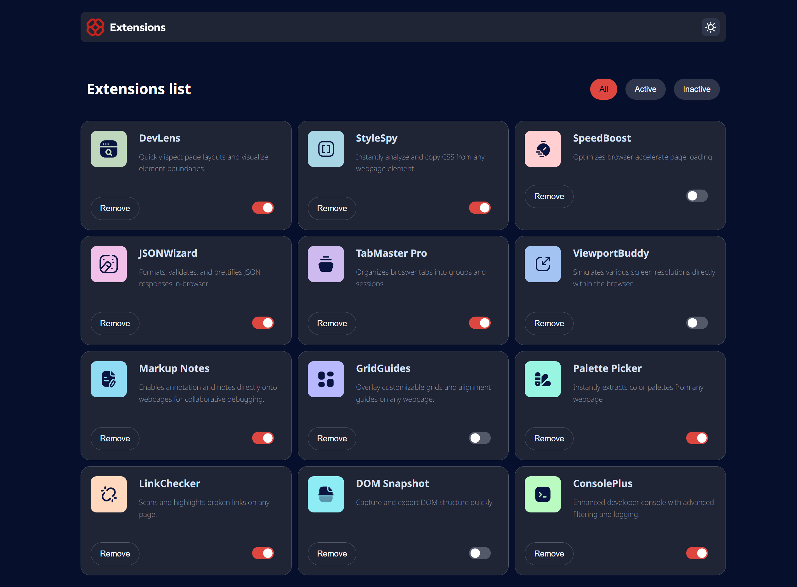

<h1 align="center">Browser extension manager UI</h1>

###

  
  
  
  
  

###

📝 Brief Your challenge is to build out this browser extension manager UI and get it looking as close to the design as possible.  You can use any tools you like to help you complete the challenge. So if you've got something you'd like to practice, feel free to give it a go.  We provide the data for the extensions in a local data.json file. So you can use that to add the data dynamically if you choose.  Your users should be able to:  Toggle extensions between active and inactive states Filter active and inactive extensions Remove extensions from the list Select their color theme View the optimal layout for the interface depending on their device's screen size See hover and focus states for all interactive elements on the page

###

